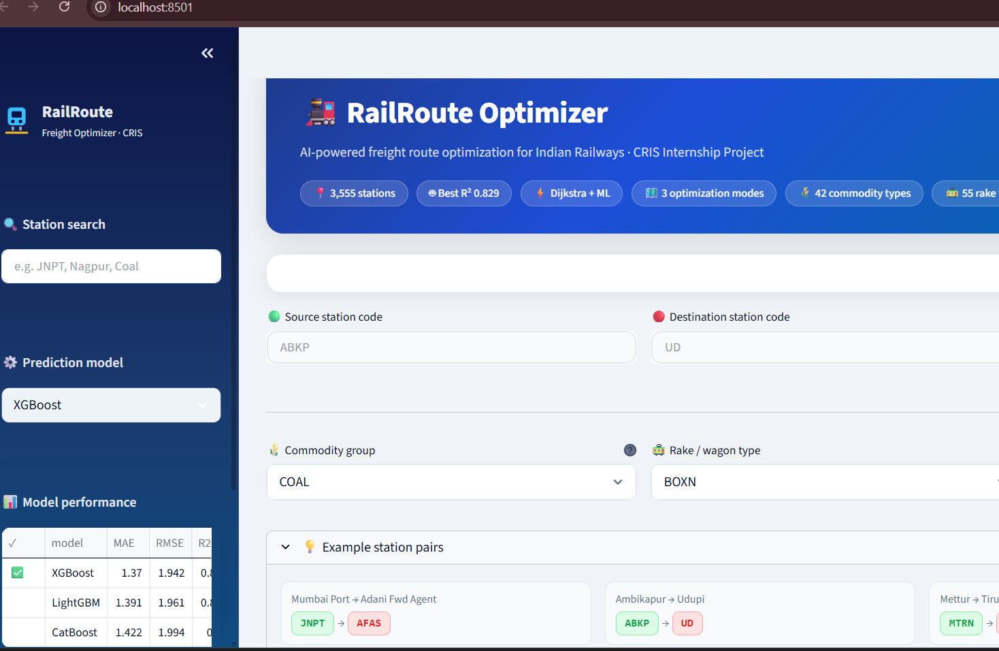
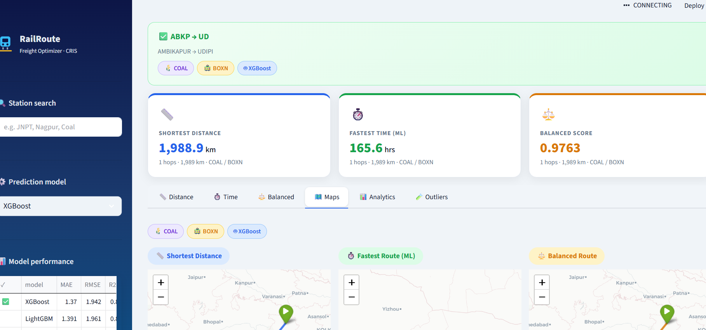

# 🚆 Freight Route Analytics
### AI-Powered Indian Railways Freight Route Optimization | CRIS Internship Project


---

## 📌 Overview

**Freight Route Analytics** is an intelligent railway freight route optimization system developed during my internship at **CRIS (Centre for Railway Information Systems)**.

The application analyzes **4.4 lakh+ real Indian Railways freight movement records** and recommends the most efficient freight route between any two stations using **Machine Learning** and **Graph Algorithms**.

The system predicts freight movement speed using multiple ML models and applies **Dijkstra's Algorithm** to generate optimal routes based on:

- 🚆 Shortest Distance
- ⏱ Fastest Travel Time
- ⚖ Balanced Route (Distance + Time)

---

# ✨ Features

- 🚉 Search freight routes between any two railway stations
- 🗺 Interactive route visualization using Folium Maps
- 🤖 Machine Learning-based speed prediction
- ⚡ XGBoost, LightGBM & CatBoost support
- 📊 Interactive analytics dashboard
- 📈 Model performance comparison
- 📍 Station search using station code
- 🔄 Route comparison
- 🚆 Hop-by-hop route breakdown
- 📉 Outlier analysis
- 🎯 User-friendly Streamlit interface

---

# 🧠 Machine Learning Models

The application predicts **Circuit Speed (km/h)** using three regression models.

| Model | Purpose |
|--------|----------|
| 🥇 XGBoost | Highest prediction accuracy |
| 🥈 LightGBM | Fast training and inference |
| 🥉 CatBoost | Better handling of categorical features |

---

# 📊 Model Performance

| Model | MAE | RMSE | R² Score |
|------|------:|------:|------:|
| 🥇 XGBoost | **1.386** | **1.958** | **0.826** |
| 🥈 LightGBM | 1.421 | 1.994 | 0.820 |
| 🥉 CatBoost | 1.446 | 2.020 | 0.815 |

**Target Variable:** `circuit_speed`

---

# 🛤 Route Optimization

The system generates three optimized routes using **Dijkstra's Algorithm**.

| Route | Optimization |
|---------|--------------|
| 🚆 Shortest Route | Minimum Distance |
| ⏱ Fastest Route | Minimum Travel Time |
| ⚖ Balanced Route | Distance + Time |

---

# 📈 Dataset Statistics

| Metric | Value |
|---------|-------|
| Freight Records | 4,41,000+ |
| Railway Stations | 3,555 |
| Directed Routes | 35,636 |
| Commodity Types | 42 |
| Wagon Types | 55 |

---

# 🛠 Tech Stack

## Programming Language

- Python

## Machine Learning

- XGBoost
- LightGBM
- CatBoost
- Scikit-learn

## Data Processing

- Pandas
- NumPy

## Graph Processing

- NetworkX

## Visualization

- Streamlit
- Plotly
- Folium
- Streamlit-Folium

---

# 📂 Project Structure

```text
Freight_Route_Analytics/
│
├── data/
│   ├── railrake.csv
│   ├── graph.pkl
│   ├── station_map.pkl
│   └── ...
│
├── models/
│   └── models_bundle.pkl
│
├── screenshots/
│   ├── homepage.png
│   └── result.png
│
├── src/
│   ├── app.py
│   ├── analytics.py
│   ├── preprocessing.py
│   ├── train_models.py
│   ├── pathfinder.py
│   ├── map.py
│   └── ...
│
├── requirements.txt
├── run_pipeline.py
└── README.md
```

---

# ⚙ Installation

## Clone Repository

```bash
git clone https://github.com/bhhumiii/Freight_Route_Analytics.git
```

```bash
cd Freight_Route_Analytics
```

---

## Install Dependencies

```bash
pip install -r requirements.txt
```

---

## Run Data Pipeline

```bash
python run_pipeline.py
```

This step performs:

- Data Cleaning
- Feature Engineering
- Graph Construction
- ML Model Training

---

## Launch Application

```bash
streamlit run src/app.py
```

Open

```
http://localhost:8501
```

---

# 📸 Screenshots

## 🏠 Home Dashboard

Search freight routes, choose prediction models, and explore railway network statistics.



---

## 🚆 Route Optimization Results

The dashboard displays:

- ✅ Shortest Distance
- ⏱ Fastest Route
- ⚖ Balanced Route
- 🗺 Interactive Maps
- 📊 Analytics Dashboard
- 🤖 Machine Learning Predictions



---

# 📌 Dataset Features

| Feature | Description |
|----------|-------------|
| ldngsttn | Loading Station |
| uldg_sttn | Unloading Station |
| ldng_uldg_km | Distance |
| ldng_uldg_hor | Travel Time |
| circuit_speed | Target Variable |
| circuitkm | Circuit Distance |
| circuittime | Circuit Time |
| ldngzone | Loading Zone |
| uldgzone | Unloading Zone |
| raketype | Wagon Type |
| grupcmdt | Commodity Group |

---

# 🚀 Future Enhancements

- Live Indian Railways integration
- Real-time train tracking
- Delay prediction using ML
- AI-powered route recommendations
- REST API support
- Docker deployment
- Cloud deployment
- Authentication system

---

# 💼 Internship

**Organization:** Centre for Railway Information Systems (CRIS)

**Domain:** Freight Operations

**Project:** Freight Route Analytics & Optimization using Machine Learning

---

# 👩‍💻 Author

## **Bhumi Tiwari**

🎓 M.Tech (Artificial Intelligence & Machine Learning)  
🏫 Birla Institute of Technology, Mesra

💼 CRIS Intern

🔗 GitHub: https://github.com/bhhumiii

---

# ⭐ Support

If you found this project useful, please consider giving it a ⭐ on GitHub.

It motivates me to continue building impactful projects.

---

## 📬 Contact

Feel free to connect for collaboration, internships, or project discussions.

GitHub: https://github.com/bhhumiii
